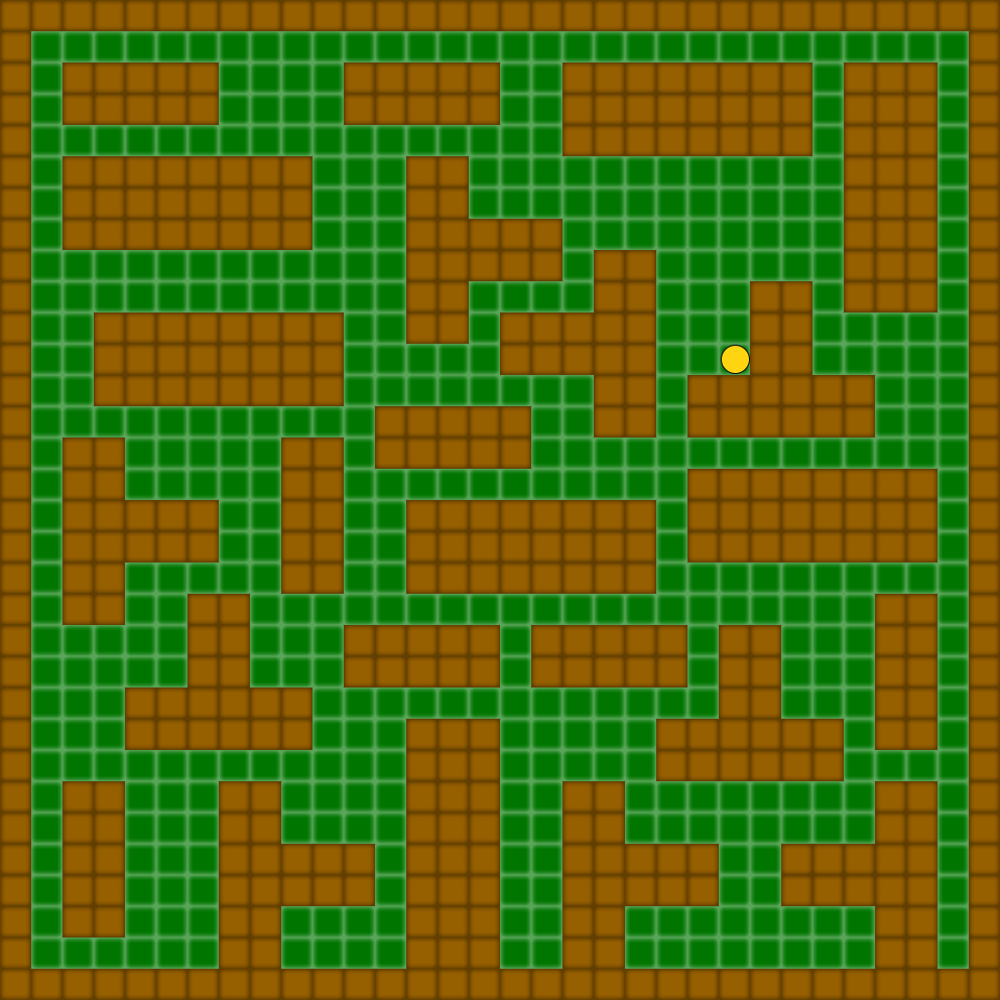
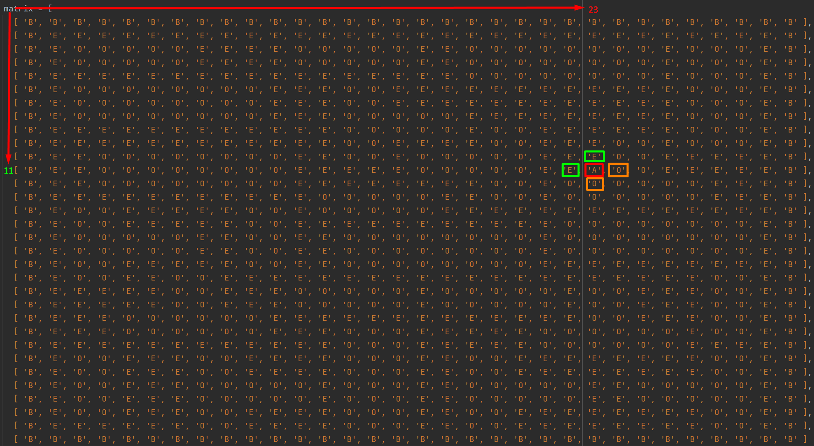

## Задание
- Написать функцию <b>canMove</b>, которая принимает двумерный массив: игровую локацию, координаты игрока и направление движения. Персонаж может двигаться только вверх, вниз, влево и вправо. Необходимо вернуть true, если по нужному направлению от игрока пустая клетка ('E') и двигаться можно, или false если нельзя.
- Функция принимает:
  - location: массив массивов, заполненных обозначениями
    - 'B' - 'Border', граница игровой карты. Движение запрещено.
    - 'O' - 'Obstacle', препятствие. Движение запрещено.
    - 'E' - 'Empty', пустая клетка. Движение разрешено.
    - 'A' - 'Actor', пустая клетка на которой стоит персонаж сейчас.
  - actorCoordinates: Объект в виде: { x: number, y: number }, координаты игрока.
  - direction: строка, направление движения. Возможные значения: 'left', 'right', 'up', 'down'.

## Примечание
- Количество внутренних массивов и элементов в них - динамическое.

## Примеры
- 
- 
- (location, {x: 23, y: 11}, 'right') => false // вправо нельзя, т.к справа препятствие ('O').
- (location, {x: 23, y: 11}, 'left') => true // а вот влево можно, слева пустая клетка ('E').
- (location, {x: 23, y: 11}, 'up') => true // вверх тоже можно
- (location, {x: 23, y: 11}, 'down') => false // вниз нельзя